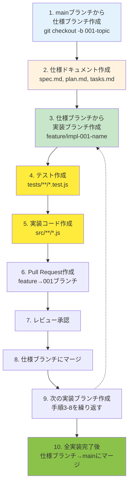

# フォトアルバムオーガナイザー プロジェクト憲法

## プロジェクト情報

**プロジェクト名**: フォトアルバムオーガナイザー
**リポジトリ**: https://github.com/J1921604/photo-album-organizer
**バージョン**: 1.0.0
**批准日**: 2025-11-18

---

## 核となる 6 つの原則

### 原則 I. テスト駆動開発の厳格実施

**非交渉型要件（MUST）**:

- すべての機能実装は、テスト作成 → ユーザー承認 → テスト失敗確認 → 実装 → テスト成功 の Red-Green-Refactor サイクルに従う MUST
- 受け入れシナリオはすべてテストケースに変換し、実装前にテストが失敗することを確認する MUST
- 単体テスト、統合テスト、コントラクトテスト、E2Eテストの 4 層テスト戦略を実装する MUST
- 新機能追加時、テストカバレッジが現在値以上を維持する MUST
- E2Eテストは100%正常に機能が動作するまで繰り返し修正する MUST
- ローカル環境でビルドとプレビューを検証し、GitHub Pages デプロイ前にテスト100%正常動作を確認する MUST

**根拠**: ユーザーストーリーを仕様に対して検証可能にし、デグレード防止と品質保証を実現する。テスト失敗から始めることで、要件漏れ検出の精度を高める。E2Eテストの完全動作により、本番環境での予期しない動作を防止する。ローカル検証により、デプロイ後の予期しない問題を事前に検出する。

---

### 原則 II. セキュリティ要件の機能要件優先化

**非交渉型要件（MUST）**:

- 機密データ（ユーザーメタデータ、タイムスタンプ、ファイル名、GPS座標等）の平文保存を禁止。暗号化またはハッシュ化を必須とする MUST
- 外部サーバーへのデータ送信、ロギング、分析トラッキング を禁止。ローカルストレージ内のみでのデータ処理を必須とする MUST
- ファイルアップロード時は MIME タイプ、ファイルサイズ、ファイル拡張子の 3 層検証を実装する MUST
- セキュリティ関連のコード変更は、セキュリティレビュー承認が機能要件承認に先行する MUST
- XSS、CSRF、インジェクション攻撃への対策を全入力・出力ポイントで実装する MUST

**根拠**: ユーザーの写真とメタデータはプライベート資産。外部漏洩リスク排除が事業継続の前提条件。機能要件より優先することで、初期段階からセキュリティ脆弱性を排除する。

---

### 原則 III. パフォーマンス閾値の定量化と受け入れ基準統合

**非交渉型要件（MUST）**:

- UI 応答時間は 1 秒以下を上限とし、メインスレッドブロッキング時間を 100ms 以下に制限する MUST
- JavaScript バンドルサイズは 300KB 以下を上限。超過時は機能削減または動的読み込みを実装する MUST
- メモリ使用量は 200MB 以下を上限。100 枚以上の写真処理時もこの制限内に収まる MUST
- パフォーマンス閾値の達成状況は、各フェーズの受け入れ基準に組み込み、未達成時は本番リリース不可を必須とする MUST
- ローカル環境でビルドとプレビューを検証し、GitHub Pages デプロイ前にテスト100%正常動作を確認する MUST
- Lighthouse Performance スコア 90 以上を維持する MUST

**根拠**: モバイルデバイスでの動作保証とユーザー満足度維持。定量化することで、パフォーマンス劣化を早期に検知でき、後続フェーズで対応コストが増加する問題を回避できる。ローカル検証により、本番環境での予期しない動作を防止する。

---

### 原則 IV. ユーザー体験の一貫性維持

**非交渉型要件（MUST）**:

- UI コンポーネントは統一されたデザイン言語を採用し、画面遷移は常に一貫したフローを保つ MUST
- エラーメッセージはユーザーに対して原因と対応方法を明示し、技術用語を避ける MUST
- すべての入力フィールドには、バリデーションエラー時のフィードバック（リアルタイム表示 ≤ 200ms）を提供する MUST
- ダークモード / ライトモード、アクセシビリティ（WCAG 2.1 Level AA）対応を実装する MUST
- フロントエンドとバックエンドを同時に起動するコードを生成し、開発効率を最大化する MUST
- モバイル、タブレット、デスクトップで一貫した操作性を提供する MUST

**根拠**: 一貫したユーザー体験は、機能の学習コストを低減し、アプリケーション全体の信頼性を向上させる。モバイル・タブレット・デスクトップ間での動作一貫性も確保する。フロントエンド/バックエンド同時起動により、開発プロセスの効率化と統合テストの円滑化を実現する。

---

### 原則 V. コード品質と保守性の継続的改善

**非交渉型要件（MUST）**:

- すべてのコードは ESLint + Prettier でのフォーマット統一を実装する MUST
- 複雑度の高い関数（循環的複雑度 > 5）は、テスト + ドキュメント + レビュー承認を必須とする MUST
- 外部依存はバージョンを固定し、`package-lock.json` を Git に含める MUST。再現性を確保する MUST
- コード変更時は、既存テストの全実行と新規テストの追加が必須。カバレッジ低下は本番リリース不可を必須とする MUST
- 正常に動作するまで繰り返し検証しエラー修正を完了する MUST。中途半端な実装を本番環境に反映しない MUST
- トークン制限まで中断せず全てのタスクを実行する MUST。品質を低下させる簡略化を禁止する MUST
- 文字化け対策として UTF-8 エンコーディングを使用する MUST

**根拠**: コード品質の継続的維持は、機能追加時のデグレード防止と保守コスト削減を実現する。バージョン固定による再現性は、本番環境での予期しない動作防止に不可欠。繰り返し検証により、エラーが完全に解消されることを保証する。トークン制限まで作業を継続することで、不完全なドキュメントや実装を防止する。

---

### 原則 VI. Mermaid 図による視覚化の標準化

**非交渉型要件（MUST）**:

- すべての仕様書、計画書、タスク書にフローチャート・ガントチャートなど Mermaid 図 v11 準拠を挿入する MUST
- Mermaid v11 のベストプラクティスに準拠する MUST（詳細は「Mermaid図ベストプラクティス」セクション参照）
- フローチャート、シーケンス図、状態遷移図、ガントチャートで日本語を使用する MUST
- gitGraph での日本語使用を避け、flowchart/graph 形式を使用する MUST
- ガントチャートは土日・年末年始を休日として着色し、スケジュールを入れない MUST
- 相対日付方式で任意に開始日を変更できるガントチャートを作成する MUST

**根拠**: 視覚化により、技術者以外のステークホルダーも仕様理解が容易になり、レビュー効率が向上する。Mermaid v11 準拠により、最新の機能と日本語対応を活用できる。相対日付方式により、プロジェクト開始日変更時の修正コストを削減する。

---

## 3 つの制約条件

### 制約 I. 機密データの暗号化・ハッシュ化必須

**内容**:

- ユーザーのメタデータ（撮影日時、写真の場所、カメラモデル、ファイルパス、GPS座標等）は、localStorage に平文で保存することを禁止 MUST
- 最小限、ハッシュ化（SHA-256）またはクライアント側暗号化（AES-GCM）を実装する MUST
- 暗号化鍵の管理方法を明記し、鍵漏洩時の対応手順を事前に定義する MUST
- EXIF データから個人情報（GPS座標、デバイス情報等）を除外または暗号化する MUST

**例外処理**: なし

---

### 制約 II. 外部依存のバージョン固定による再現性確保

**内容**:

- `package.json` に記載するすべての依存は `^` または `~` ではなく、明示的にバージョン固定する（例: `"sql.js": "1.13.0"`） MUST
- `npm ci` コマンドを使用し、`package-lock.json` から正確に同一バージョンを再現する MUST
- 依存アップデートは計画的に行い、テスト + レビュー承認後にのみ本番適用する MUST
- セキュリティ脆弱性スキャンを定期実行し、脆弱性発見時は緊急対応する MUST

**例外処理**: セキュリティ脆弱性修正時は、最小限の更新を実施後、直ちに本番適用可能

---

### 制約 III. 仕様と実装の乖離検知・是正

**内容**:

- 仕様書 (`spec.md`) とコード実装は、毎フェーズ終了時に整合性チェックを実施する MUST
- 乖離発見時は、レビュー会議で原因を特定し、仕様修正または実装修正のいずれかを選択して記録する MUST
- 重大な乖離（受け入れ基準未達成等）は、本番リリース前に必ず是正する MUST
- ドキュメントとコードの二重管理を避け、単一情報源（Single Source of Truth）を維持する MUST

**例外処理**: なし

---

## 3 つのガバナンスルール

### ルール I. 開発の段階的ゲーティング

**作業順序（必須流れ）**:

1. **憲法チェック**: 要件の 6 原則遵守確認（新規フィーチャー開始時）
2. **仕様策定**: `spec.md` でユーザーストーリー定義（Phase 0）
3. **計画策定**: `plan.md` で技術設計・リサーチ（Phase 0）
4. **タスク分解**: `tasks.md` で実装タスク化（Phase 1）
5. **実装検証**: テスト → 実装 → レビュー（Phase 2-N）
6. **統合テスト**: 各フェーズの受け入れ基準検証（各フェーズ末）
7. **リリース審査**: 本番環境デプロイ前の最終チェック

**ゲート不合格時の対応**: 次フェーズは進行禁止。前フェーズへ戻り修正。

---

### ルール II. Git ブランチ戦略による仕様・実装分離

**ブランチ命名規則**:

```bash
mainブランチ（本番環境の正式版）
  ↓ (git checkout main; git checkout -b <番号>-<短い名前>)
仕様ブランチ: 001-photo-album-organizer, 002-batch-processing など
  ↓ (git checkout 001-photo-album-organizer; git checkout -b feature/impl-<番号>-<短い名前>)
実装ブランチ: feature/impl-001-metadata-encryption, feature/impl-001-ui-responsive など
  ↓ (Pull Request + Review)
仕様ブランチにマージ
  ↓ (全ユーザーストーリー完了後、Pull Request + 最終レビュー)
mainにマージ
```

**ブランチ対応表**:

| ブランチタイプ | 派生元       | 目的                                     | マージ先     |
| -------------- | ------------ | ---------------------------------------- | ------------ |
| 仕様ブランチ   | main         | ユーザーストーリー仕様 + 技術計画 + 実装 | main         |
| 実装ブランチ   | 仕様ブランチ | 個別タスク実装                           | 仕様ブランチ |

**コミットメッセージ形式**（Conventional Commits 準拠）:

- 仕様ブランチ: `docs: <フィーチャー> 仕様追加 (<番号>)`
- 実装ブランチ: `feat: <機能> 実装 (<番号>)` or `test: <テスト> 追加 (<番号>)`
- テンプレート更新: `docs: テンプレート更新 - 憲法v1.0対応`
- 憲法更新: `docs: 憲法をv1.0.0に更新 (原則追加)`

---

### ルール III. 重大変更のレビュー承認必須化

**重大変更の定義**:

- **仕様変更**: ユーザーストーリーの受け入れ基準、セキュリティ要件の追加・削除・変更
- **パフォーマンス基準変更**: 応答時間、バンドルサイズ、メモリ上限の変更
- **依存ライブラリ**: メジャーバージョンアップ、セキュリティ脆弱性対応
- **API コントラクト変更**: 入出力形式、データ構造、エラーハンドリング
- **憲法変更**: 原則・制約・ガバナンスルールの追加・削除・変更

**レビュープロセス**:

1. Pull Request 作成時に「重大変更」ラベルを付与
2. チームメンバー 2 名以上の承認を取得する MUST
3. 承認者は以下をチェック: 仕様/実装整合性、セキュリティリスク、パフォーマンス影響
4. 承認後、仕様ブランチにマージ

**例外**: なし（すべての重大変更は承認必須）

---

## 開発環境と実行方針

### Python 実行環境

**標準環境**: Python 3.10.11

**実行コマンド**: `py -3.10` を使用する MUST（`python` ではなく）

**根拠**: バージョン固定により再現性を確保し、異なる Python バージョンによる予期しない動作を防止する。

### ローカル検証の徹底

**ローカル実装の必須手順**:

1. ローカルでビルド実行: `npm run build`
2. ローカルでプレビュー実行: `npm run preview`
3. テスト100%正常動作確認: `npm run test`
4. E2Eテスト実行と修正: テスト失敗時は繰り返し修正
5. 上記すべて完了後、GitHub Pages デプロイ

**根拠**: 本番環境（GitHub Pages）でのエラーを事前に検出し、ユーザー影響を最小化する。

---

## Git ブランチ戦略（詳細フロー）

### 初期化フロー



### 継続的開発フロー

```bash
# 新規フィーチャー追加時
git checkout main
git pull origin main
git checkout -b 002-batch-processing

# その後の流れは「初期化フロー」の手順 2 以降と同一
```

---

## Mermaid 図ベストプラクティス

### Mermaid v11 対応の必須ガイドライン

**1. gitGraph 使用時の注意**:

- 日本語を避けるか、flowchart/graph 形式を使用する MUST
- tag: 構文は非推奨、代わりにノードで表現する MUST

**2. 日本語対応**:

- flowchart、graph、sequenceDiagram は日本語完全対応
- ノードラベル、エッジラベル、Note で日本語使用可能

**3. 推奨構文**:

- ブランチ戦略: flowchart TB + subgraph
- プロセスフロー: flowchart TD/LR
- 時系列: sequenceDiagram
- 状態遷移: stateDiagram-v2

---

## Governance（ガバナンス）

### 憲法の修正プロセス

**バージョニング規則**（セマンティックバージョニング準拠）:

- **パッチ（x.y.Z）**: 文言修正、タイポ、軽微な明確化

  - 承認: PR 1 名承認で可
  - 通知: チーム通知不要
- **マイナー（x.Y.0）**: 原則追加、既存原則の拡張、新セクション追加

  - 承認: PR 2 名承認必須
  - 通知: チーム全体に通知必須
  - 例: 原則 VI「Mermaid 図の標準化」の追加
- **メジャー（X.0.0）**: 原則削除、本質的な再定義、後方互換性のない変更

  - 承認: 全チーム承認必須
  - 通知: チーム全体に通知 + 移行計画作成必須
  - 例: 原則の削除、セキュリティ基準の大幅変更

### テンプレートの整合性確認

このファイルに記載された原則・制約・ガバナンスルールは、以下のテンプレートに反映される MUST:

- `.specify/templates/plan-template.md`: 「Constitution Check」セクションで 6 つの原則を参照
- `.specify/templates/spec-template.md`: 「User Scenarios & Testing」で TDD 原則と優先度付け（P1-P3）ルール を適用
- `.specify/templates/tasks-template.md`: Phase 別タスク分類で段階的ゲーティングを実装、Mermaid 図を挿入
- `.specify/templates/checklist-template.md`: レビューチェックリストでセキュリティ優先・パフォーマンス基準確認を追加

### 準拠の検証方法

- 各 PR マージ前に、このファイルの原則・制約を PR 説明に記載する MUST
- レビュアーは「憲法準拠」チェックボックスを確認してから承認する MUST
- 本番リリース前に、すべての受け入れ基準（パフォーマンス・セキュリティ・テストカバレッジ）を再検証する MUST
- 憲法バージョンをすべてのドキュメントで一貫して参照する MUST

---

**Version**: 1.0.0
**Ratified**: 2025-11-18
