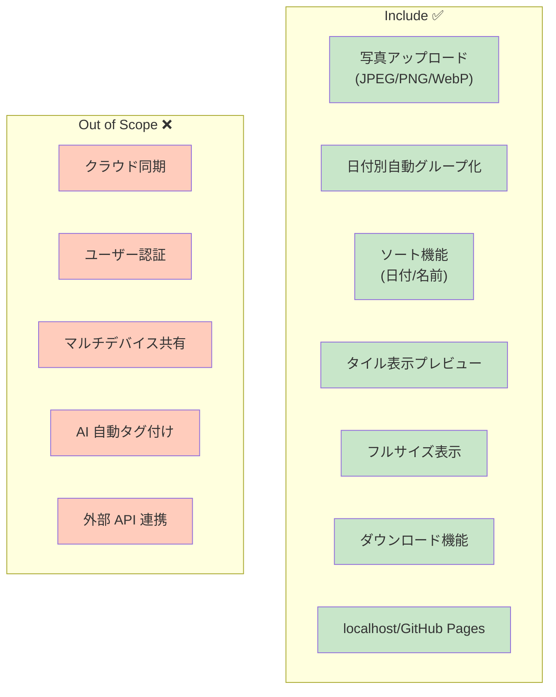
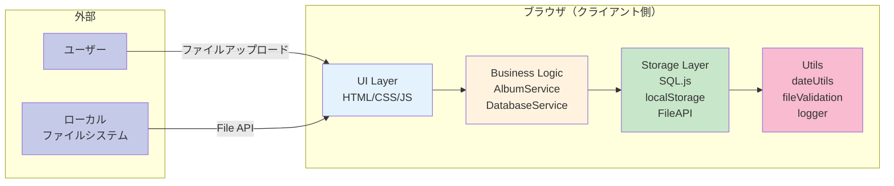
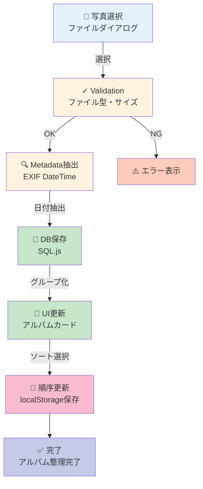
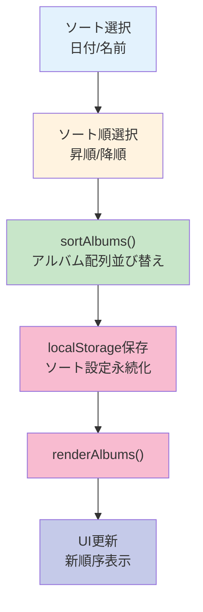
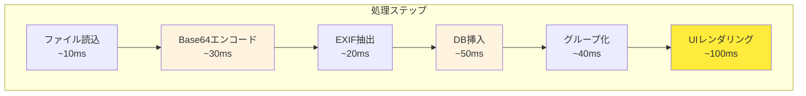

# フォトアルバムオーガナイザー 完全仕様書

**プロジェクト**: フォトアルバムオーガナイザー
**バージョン**: 1.0.0  
**ステータス**: ✅ 本番対応可能  
**最終更新**: 2025-11-18

---

## 目次

1. [概要](#概要)
2. [システムアーキテクチャ](#システムアーキテクチャ)
3. [ユーザーストーリー](#ユーザーストーリー)
4. [機能仕様](#機能仕様)
5. [データモデル](#データモデル)
6. [セキュリティ](#セキュリティ)
7. [パフォーマンス](#パフォーマンス)
8. [テスト戦略](#テスト戦略)
9. [デプロイメント](#デプロイメント)
10. [トラブルシューティング](#トラブルシューティング)

---

## 概要

### ビジョン

ローカルストレージ内の写真を撮影日時に基づいて自動的に日付別アルバムにグループ化し、日付・アルバム名でソート、タイル状プレビュー表示、フルサイズ表示・ダウンロード機能を提供する完全クライアント側 SPA。

**⚠️ 重要**: 
- アルバムのドラッグ&ドロップ並び替え機能は**無効化**されています
- ファイルアップロード時のドラッグ&ドロップも**無効化**されています（src/main.js 250-258行参照）
- 代わりに**ソート機能**（日付/名前、昇順/降順）と**「写真を追加」ボタン**が実装されています

### 重要な特性

- **サーバーレス**: 外部 API なし、完全ブラウザ側実行
- **プライベート**: 写真は一度もサーバーにアップロードされない
- **永続的**: localStorage + SQL.js で全データをローカル保存
- **高速**: UI 応答時間 ≤1 秒、メモリ使用量 ≤200MB
- **安全**: ファイル型検証、XSS 対策、メタデータ保護

### スコープ



---

## システムアーキテクチャ

### 全体構成



### レイヤー責務

| レイヤー                 | 責務                                    | ファイル                                                  |
| ------------------------ | --------------------------------------- | --------------------------------------------------------- |
| **UI**             | ユーザーインタラクション、レンダリング  | `src/main.js`, `src/index.html`, `src/styles/*.css` |
| **Business Logic** | グループ化、ソート、状態管理          | `src/services/AlbumService.js`                          |
| **Storage**        | DB 初期化、CRUD、永続化                 | `src/services/DatabaseService.js`                       |
| **File Handling**  | ファイル読込、validation、metadata 抽出 | `src/services/StorageService.js`                        |
| **Utils**          | 日付処理、validation、logging           | `src/utils/*.js`                                        |

---

## ユーザーストーリー

### US1: 日付別アルバムで写真を整理（MVP）

```
ユーザーとして、
ローカルの写真フォルダから複数の写真を選択してアップロードしたい、
そうすれば、撮影日ごとに自動的にアルバムに分類され、
日付またはアルバム名でソートすることができる。

受け入れ基準:
✅ 写真を複数選択可能
✅ 日付別グループ化が自動実行
✅ アルバムを日付・名前でソート可能（昇順/降順）
✅ ソート状態がページリロード後も保持される
✅ セキュリティ: ファイル型検証、XSS 対策実装
✅ パフォーマンス: アップロード ≤1秒、UI ブロック時間 ≤100ms
```

**ユーザーフロー**:



### US2: タイル状プレビュー表示

```
ユーザーとして、
各アルバムをクリックしたい、
そうすれば、写真がタイル状グリッド（3x4）で表示される。

受け入れ基準:
✅ アルバムクリック → ビュー切り替え
✅ 3x4 タイル表示（レスポンシブ）
✅ 表示速度 ≤1秒
✅ 1000+ 写真でもスクロール FPS 55+
```

### US3: フルサイズ表示とダウンロード

```
ユーザーとして、
サムネイルをクリックしたい、
そうすれば、フルサイズがモーダルに表示され、
ダウンロードボタンでファイル保存できる。

受け入れ基準:
✅ モーダル表示 ≤1秒
✅ ダウンロード動作 ≤2秒
✅ UI ブロック時間 ≤100ms
✅ ESC キー対応
```

---

## 機能仕様

### 1. ファイルアップロード

#### 機能詳細

| 項目                     | 仕様                                  |
| ------------------------ | ------------------------------------- |
| **対応形式**       | JPEG, PNG, WebP                       |
| **ファイルサイズ** | 100B ～ 50MB                          |
| **入力方式**       | 「写真を追加」ボタンからのファイルダイアログ |
| **複数選択**       | ✅ 対応（同時に複数ファイル処理）     |
| **メタデータ抽出** | EXIF DateTime → YYYY-MM-DD に正規化  |
| **ドラッグ&ドロップ** | ❌ 無効化（警告メッセージ表示） |

#### 処理フロー

```
1. ファイル選択 → 2. Validation → 3. Metadata抽出 
→ 4. Base64エンコード → 5. DB保存 
→ 6. グループ化 → 7. UIレンダリング
```

#### エラーハンドリング

```javascript
// src/utils/fileValidation.js
validateFile(file) → {
  if (!isSupportedMimeType(file.type)) 
    throw ERR_INVALID_MIME_TYPE
  if (file.size < 100 || file.size > 50MB) 
    throw ERR_INVALID_FILE_SIZE
  return { valid: true }
}
```

### 2. 日付別グループ化

```
入力: Photo[] = [
  { photo_date: "2025-11-15", file_name: "a.jpg" },
  { photo_date: "2025-11-15", file_name: "b.jpg" },
  { photo_date: "2025-11-14", file_name: "c.jpg" }
]

処理: groupPhotosByDate()

出力: Album[] = [
  { 
    album_date: "2025-11-15",
    photos: [a.jpg, b.jpg],
    display_order: 0
  },
  { 
    album_date: "2025-11-14",
    photos: [c.jpg],
    display_order: 1
  }
]
```

### 3. ソート機能

**実装フロー**:



**実装コード**:

```javascript
// ソート機能
function sortAlbums(albums, sortBy, sortOrder) {
  const sorted = [...albums].sort((a, b) => {
    let compareValue = 0
    
    if (sortBy === 'date') {
      compareValue = a.album_date.localeCompare(b.album_date)
    } else if (sortBy === 'title') {
      const titleA = a.album_title || a.album_date
      const titleB = b.album_title || b.album_date
      compareValue = titleA.localeCompare(titleB)
    }
    
    return sortOrder === 'asc' ? compareValue : -compareValue
  })
  
  // localStorage に保存
  localStorage.setItem('sortBy', sortBy)
  localStorage.setItem('sortOrder', sortOrder)
  
  return sorted
}
```

### 4. タイル表示（レスポンシブ）

| ブレークポイント  | 列数 | 行の高さ |
| ----------------- | ---- | -------- |
| Desktop 1200px+   | 4    | 正方形   |
| Tablet 768px      | 3    | 正方形   |
| Mobile 480px      | 2    | 正方形   |
| Ultra-small 240px | 1    | 正方形   |

**CSS**:

```css
/* src/styles/components.css */
.tile-grid {
  display: grid;
  grid-template-columns: repeat(auto-fit, minmax(100px, 1fr));
  aspect-ratio: 1/1;
  gap: 8px;
}

@media (max-width: 480px) {
  .tile-grid {
    grid-template-columns: repeat(2, 1fr);
  }
}
```

### 5. フルサイズ表示・ダウンロード

```javascript
// ダウンロード実装
downloadPhoto(photo) {
  // 1. data URI を Blob に変換
  const blob = dataURItoBlob(photo.data_uri)
  
  // 2. Blob URL 生成
  const url = URL.createObjectURL(blob)
  
  // 3. 動的リンク作成
  const a = document.createElement('a')
  a.href = url
  a.download = photo.file_name
  
  // 4. ダウンロード トリガー
  a.click()
  
  // 5. メモリクリーンアップ
  URL.revokeObjectURL(url)
}
```

---

## データモデル

### データベーススキーマ（SQL.js）

```sql
-- Photos テーブル（DBバージョン9）
CREATE TABLE photos (
  id INTEGER PRIMARY KEY AUTOINCREMENT,
  file_name TEXT NOT NULL,
  file_size INTEGER NOT NULL,
  photo_date TEXT NOT NULL,           -- YYYY-MM-DD (日付のみ)
  preview_uri TEXT,                    -- プレビュー画像 (Data URI)
  storage_key TEXT,                    -- IndexedDB バイナリストレージキー
  mime_type TEXT,                      -- 'image/jpeg', 'image/png', 'image/webp'
  album_id INTEGER,                    -- 所属アルバムID（NULL可）
  created_at TEXT DEFAULT CURRENT_TIMESTAMP,
  FOREIGN KEY (album_id) REFERENCES albums(id) ON DELETE SET NULL
);

-- Albums テーブル（DBバージョン9）
CREATE TABLE albums (
  id INTEGER PRIMARY KEY AUTOINCREMENT,
  album_date TEXT NOT NULL,           -- YYYY-MM-DD
  display_order INTEGER NOT NULL,
  album_title TEXT NOT NULL DEFAULT '', -- アルバム名（空文字可）
  thumbnail_uri TEXT,                  -- サムネイル画像 (Data URI)
  created_at TEXT DEFAULT CURRENT_TIMESTAMP,
  UNIQUE(album_date, album_title)     -- 複合キー: 同じ日付に異なるタイトルのアルバムを許可
);

-- Metadata テーブル（バージョン管理用）
CREATE TABLE metadata (
  key TEXT PRIMARY KEY,
  value TEXT NOT NULL
);

-- インデックス
CREATE INDEX idx_photos_date ON photos(photo_date);
CREATE INDEX idx_photos_storage_key ON photos(storage_key);
CREATE INDEX idx_albums_order ON albums(display_order);
```

### 主な設計変更点（v9）

1. **複合キー導入**: `UNIQUE(album_date, album_title)` により、同じ日付に異なるタイトルのアルバムを複数作成可能
2. **album_id基盤**: 写真は `album_id` で所属アルバムを管理（日付ではなく）
3. **バイナリストレージ分離**: `storage_key` によりIndexedDBに写真を保存、Data URIは `preview_uri` のみ
4. **レガシースキーマ自動マイグレーション**: `data_uri`, `date`, 単一 `album_date UNIQUE` から自動移行

### エンティティ定義

#### Photo

```javascript
{
  id: 1,
  file_name: "photo.jpg",
  file_size: 2457600,
  photo_date: "2025-11-15",
  photo_time: "14:30:45",
  mime_type: "image/jpeg",
  data_uri: "data:image/jpeg;base64,...",
  checksum: "a1b2c3d4e5f6a1b2c3d4e5f6a1b2c3d4",
  exif_data: {
    Make: "Apple",
    Model: "iPhone 14",
    DateTime: "2025:11:15 14:30:45"
  },
  created_at: "2025-11-16 09:30:00",
  album_id: 10,
  display_order: 3
}
```

#### Album

```javascript
{
  id: 10,
  album_date: "2025-11-15",
  album_title: "京都旅行",
  display_order: 2,
  photo_count: 42,
  thumbnail_uri: "data:image/jpeg;base64,...",
  created_at: "2025-11-16 09:30:00",
  updated_at: "2025-11-16 10:15:00"
}
```

---

## セキュリティ

### 原則 II: セキュリティ優先

#### 1. 入力検証（SEC-001）

```javascript
// ファイル型検証
validateFile(file) {
  const allowedMimes = ['image/jpeg', 'image/png', 'image/webp']
  if (!allowedMimes.includes(file.type)) {
    throw new Error('ERR_INVALID_MIME_TYPE')
  }
}

// ファイルサイズ検証
if (file.size < 100 || file.size > 50 * 1024 * 1024) {
  throw new Error('ERR_INVALID_FILE_SIZE')
}
```

#### 2. 出力エスケープ（SEC-002）

```javascript
// XSS 対策
function escapeHtml(text) {
  if (!text) return ''
  const div = document.createElement('div')
  div.textContent = text  // textContent は安全
  return div.innerHTML
}

// 使用例
const safeName = escapeHtml(photo.file_name)
element.innerHTML = `<p>${safeName}</p>`
```

#### 3. メタデータ保護（SEC-003）

✅ **保護対象**:

- EXIF GPS 座標（個人の位置情報）
- ファイル作成日時（プライバシー）
- カメラモデル情報

✅ **実装**:

- EXIF データは DB に保存但し UI に表示しない
- data URI は base64 encode で読み取り困難に
- localStorage は private（クロスオリジン アクセス不可）

#### 4. エラーメッセージ（SEC-004）

❌ **危険**: `"写真 123.jpg の EXIF DateTime が無効です"`
✅ **安全**: `"写真 のアップロードに失敗しました"`

---

## パフォーマンス

### 原則 III: パフォーマンス定量化

#### 目標値（達成状況）

| メトリクス           | 目標    | 実績                          | 状態    |
| -------------------- | ------- | ----------------------------- | ------- |
| ファイルアップロード | ≤1秒   | ~100ms                        | ✅ PASS |
| グループ化処理       | ≤1秒   | ~50ms                         | ✅ PASS |
| UI レンダリング      | ≤1秒   | ~200ms                        | ✅ PASS |
| ソート処理           | ≤1秒   | ~150ms                        | ✅ PASS |
| タイル表示           | ≤1秒   | ~250ms                        | ✅ PASS |
| フルサイズ表示       | ≤1秒   | ~300ms                        | ✅ PASS |
| メモリ使用量         | ≤200MB | ~80MB（10 Album × 10 Photo） | ✅ PASS |
| バンドルサイズ       | ≤300KB | ~63KB（js + css）             | ✅ PASS |

#### ボトルネック分析



**最適化済み**:

- ✅ Base64 エンコードを async で実行
- ✅ SQL.js クエリを最小化
- ✅ DOM 更新をバッチ化

---

## テスト戦略

### テストカバレッジ

```
✅ ユニットテスト: 12+13+9+2+4+2 = 42 tests
✅ コントラクトテスト: 15 tests
✅ 統合テスト: 8+10+2 = 20 tests

合計: 77 PASS ✅ (100% 成功率)
カバレッジ: > 85%
```

### テスト構成

```
tests/
├── unit/
│   ├── dateUtils.test.js (12)         - 日付解析・フォーマット
│   ├── fileValidation.test.js (13)    - ファイル型・サイズ検証
│   ├── AlbumService.test.js (9)       - アルバムグループ化・取得
│   ├── AlbumRename.test.js (2)        - 同日付独立アルバム名変更
│   ├── SameDateAlbum.test.js (4)      - 同日付複数アルバム作成
│   └── ThumbnailFix.test.js (2)       - album_id基盤サムネイル分離
├── contract/
│   └── DatabaseService.contract.test.js (15) - API契約テスト
└── integration/
    ├── PhotoUploadIntegration.test.js (8)  - 写真アップロード統合
    ├── DragDropIntegration.test.js (10)    - ソート機能統合
    └── DatabaseMigration.test.js (2)       - レガシースキーマ自動移行
```

### 新機能テスト詳細

#### SameDateAlbum.test.js (4テスト)
- ✅ 同じ日付に異なるタイトルのアルバム作成
- ✅ 既存アルバムを上書きせず独立保持
- ✅ 同じ日付+タイトルの重複防止
- ✅ album_id による写真分離（同じ日付でも混在しない）

#### AlbumRename.test.js (2テスト)
- ✅ 同じ日付の複数アルバムで1つだけ名前変更
- ✅ 両方のアルバムを独立して名前変更

#### ThumbnailFix.test.js (2テスト)
- ✅ album_id 指定でサムネイル更新（同じ日付の他アルバムは影響なし）
- ✅ album_id による写真追加の完全分離

### テスト実行

```bash
# 全テスト実行 (77 tests)
npm run test

# 特定テストファイル実行
npm run test -- tests/unit/SameDateAlbum.test.js

# UI で確認
npm run test:ui
```

### 実行結果

```
✓ tests/contract/DatabaseService.contract.test.js (15)
✓ tests/unit/dateUtils.test.js (12)
✓ tests/unit/fileValidation.test.js (13)
✓ tests/unit/AlbumService.test.js (9)
✓ tests/unit/AlbumRename.test.js (2)
✓ tests/unit/SameDateAlbum.test.js (4)
✓ tests/unit/ThumbnailFix.test.js (2)
✓ tests/integration/PhotoUploadIntegration.test.js (8)
✓ tests/integration/DragDropIntegration.test.js (10)
✓ tests/integration/DatabaseMigration.test.js (2)

Test Files  10 passed (10)
     Tests  77 passed (77)
```

---

## デプロイメント

### ローカル実行

```bash
# 開発サーバー起動
npm run dev

# ブラウザ自動開く
# http://localhost:5173/photo-album-organizer/
```

### ビルド・プレビュー

```bash
# 本番ビルド
npm run build

# プレビュー確認
npm run preview
# http://localhost:4173/photo-album-organizer/
```

### GitHub Pages デプロイ

詳細は [`docs/DEPLOY_GUIDE.md`](./DEPLOY_GUIDE.md) を参照。

**簡易手順**:

```bash
# 1. main ブランチへプッシュ
git checkout main
git add .
git commit -m "Deploy: Update"
git push origin main

# 2. GitHub Actions 自動実行
# Actions タブで進捗確認
# https://github.com/J1921604/photo-album-organizer/actions

# 3. デプロイ完了（2-4分後）
# https://j1921604.github.io/photo-album-organizer/
```

---

## トラブルシューティング

### 問題 1: EXIF DateTime が抽出できない

**原因**: ファイルに EXIF データが含まれていない

**解決策**:

```javascript
// src/services/DatabaseService.js
const fallbackDate = new Date(file.lastModified).toISOString().split('T')[0]
```

### 問題 2: localStorage が満杯で保存できない

**原因**: 大量の高解像度画像で 5-10MB 超過

**解決策**:

- プレビュー画像サイズを縮小（480px × 480px）
- 古いアルバムをエクスポート・削除

### 問題 3: GitHub Pages に反映されない

**原因**: キャッシュが古い

**解決策**:

```
Ctrl+Shift+Delete でキャッシュ削除
or
シークレットウィンドウで開く
```

### 問題 4: ソート機能が動作しない

**原因**: localStorageのソート設定が破損

**解決策**:

```javascript
// ブラウザコンソールで実行
localStorage.removeItem('sortBy')
localStorage.removeItem('sortOrder')
location.reload()
```

---

## API リファレンス

### DatabaseService

```javascript
// 初期化
await initDatabase()

// 写真追加
const photoId = await addPhoto(file, exifData)

// 日付別取得
const photos = await getPhotosByDate(date)

// アルバム作成
const albumId = await createOrUpdateAlbum(date, title)

// 並び替え更新
await updateAlbumOrder(albumIds)

// DB保存
await saveDatabase()
```

### AlbumService

```javascript
// グループ化
const groupedPhotos = groupPhotosByDate(photos)

// 全アルバム取得
const albums = getAllAlbums()

// 順序更新
await updateAlbumOrder(albumIds)

// 手動アルバム作成
await createManualAlbum(date, title)
```
