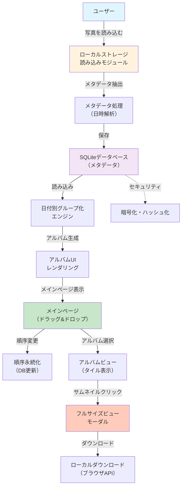

# フィーチャー仕様：フォトアルバムオーガナイザー

**ブランチ**: `001-photo-album-organizer`
**作成日**: 2025-11-18
**ステータス**: 実装完了
**入力**: ユーザー説明: 「写真を別々のアルバムに整理できるアプリケーション。アルバムは日付ごとにグループ化され、ドラッグ&ドロップで再編成可能。各アルバム内は写真がタイル状でプレビュー表示。サムネイルクリックでフルサイズ表示・ダウンロード可能。」

## ユーザーシナリオとテスト *(必須)*

### ユーザーストーリー1 - 写真を日付別アルバムで整理 (優先度: P1)

ユーザーが複数の写真をアップロードすると、撮影日時に基づいて自動的に日付ごとのアルバムにグループ化される。各アルバムはメインページで表示され、ドラッグ&ドロップで再編成できる。

**この優先度の理由**: コアとなるユーザー体験。これなしには他の機能が意味を持たない。

**独立テスト**: 日付別アルバムの自動グループ化だけで完全なMVPが実現される。ユーザーは写真を整理し、カテゴライズされたアルバムを確認できる。

**受け入れシナリオ**:

1. **初期状態**: ローカルストレージに5枚の写真がある（撮影日時メタデータ付き）
   **実行**: アプリケーションを開く
   **期待される結果**: 撮影日時に基づいて自動的に日付別アルバムが作成され、メインページに表示される
2. **初期状態**: メインページに日付別アルバムが複数表示されている
   **実行**: アルバムをドラッグしてドロップして位置を入れ替える
   **期待される結果**: アルバムの表示順序がローカルデータベースに即座に保存される（1秒以内）
3. **初期状態**: 日付別アルバムが複数存在
   **実行**: 同じ日付で異なる時間に撮影した複数の写真が入力される
   **期待される結果**: 同じアルバムに統合される

---

### ユーザーストーリー2 - 各アルバム内で写真をタイル状プレビュー表示 (優先度: P2)

ユーザーがアルバムを選択すると、そのアルバム内のすべての写真がタイル状のグリッドレイアウトでプレビュー表示される。各タイルはサムネイル画像で表示され、最大3行×4列の推奨レイアウトが適用される。

**この優先度の理由**: P1の後、ユーザーが特定のアルバムを探索するための基本的な機能。

**独立テスト**: タイルプレビュー機能だけで、ユーザーはアルバム内の写真を視覚的に参照できる。

**受け入れシナリオ**:

1. **初期状態**: アルバムが存在し、10枚以上の写真を含む
   **実行**: アルバムをクリック
   **期待される結果**: タイル状グリッドレイアウト（推奨3行×4列）でサムネイルが表示される。ページ読み込み時間は1秒以内。
2. **初期状態**: タイルプレビューが表示されている
   **実行**: 20枚以上の写真を含むアルバムでスクロール
   **期待される結果**: メモリ使用量が増加せず、スクロールは滑らかで遅延がない

---

### ユーザーストーリー3 - サムネイルクリックでフルサイズ表示とダウンロード (優先度: P3)

ユーザーがタイルのサムネイルをクリックすると、フルサイズの画像がモーダルまたは新ウィンドウで表示される。ユーザーは「ダウンロード」ボタンをクリックしてフルサイズ画像をローカルに保存できる。

**この優先度の理由**: P1・P2の後、ユーザーが写真をエクスポートするための補足的な機能。

**独立テスト**: フルサイズ表示とダウンロード機能だけで、ユーザーは選択した写真を高解像度で表示・保存できる。

**受け入れシナリオ**:

1. **初期状態**: タイルプレビューが表示されている
   **実行**: サムネイルをクリック
   **期待される結果**: フルサイズ画像がモーダルで表示される（表示時間1秒以内）
2. **初期状態**: フルサイズ画像が表示されている
   **実行**: 「ダウンロード」ボタンをクリック
   **期待される結果**: ブラウザのダウンロード機能によりファイルが保存される。メタデータは削除されずに保存される。

---

### エッジケース

- アルバムが空の場合、どう表示するか？ → 「このアルバムに写真がありません」と表示
- 同じ日付の写真が1000枚以上の場合、パフォーマンスは保証されるか？ → メモリ効率的な仮想スクロール実装で対応
- 撮影日時メタデータが欠落している写真はどう処理するか？ → 「未分類」アルバムに配置
- ブラウザを閉じた後、ドラッグ&ドロップでの並び替え順序は復元されるか？ → はい、ローカルデータベースに保存される

## 要件 *(必須)*

### 機能要件

- **FR-001**: システムは、ローカルストレージから写真ファイル（JPEG、PNG、WebP）を読み込む能力を持つ必要がある
- **FR-002**: システムは、各写真のメタデータ（撮影日時、ファイル名、ファイルサイズ）をローカルSQLiteデータベースに保存する必要がある
- **FR-003**: システムは、撮影日時に基づいて写真を日付別にグループ化し、各アルバムを作成する必要がある
- **FR-004**: システムは、メインページでドラッグ&ドロップによるアルバム並び替え機能を提供する必要がある
- **FR-005**: システムは、アルバム選択時にタイル状グリッドレイアウト（推奨3行×4列）でサムネイルを表示する必要がある
- **FR-006**: システムは、サムネイルクリック時にモーダルでフルサイズ画像を表示する必要がある
- **FR-007**: システムは、フルサイズ表示画面にダウンロードボタンを提供し、ユーザーが写真をダウンロードできるようにする必要がある
- **FR-008**: システムは、オンラインストレージサービスに写真をアップロードしてはならない（ローカルのみ）
- **FR-009**: システムは、アルバムの並び替え順序をローカルSQLiteデータベースに永続化する必要がある

### セキュリティ要件

- **SEC-001**: すべてのメタデータはローカルSQLiteデータベースに保存され、暗号化またはハッシュ化される必要がある
- **SEC-002**: システムは、ローカルストレージ内のすべてのファイルアクセスを制限し、認可されたユーザーのみが写真にアクセスできるようにする必要がある
- **SEC-003**: 外部サーバーへのネットワーク通信は最小限に留める（GitHub Pagesホスティングのみ）
- **SEC-004**: 入力検証：ファイル型とメタデータフォーマットを厳密に検証する必要がある

### キーエンティティ

- **Photo（写真）**: ファイルパス、ファイル名、サイズ、撮影日時、表示順序を属性として持つ
- **Album（アルバム）**: 撮影日付、アルバム名、含まれる写真リスト、表示順序を属性として持つ
- **AlbumOrder（アルバム順序）**: アルバムID、表示順序インデックスを属性として持つ

## パフォーマンス要件 *(憲法に基づき必須)*

- **PERF-001**: UI応答時間 - ユーザーインタラクション（ドラッグ&ドロップ、写真読込）は1秒以内に完了
- **PERF-002**: 大規模アルバム対応 - システムは1000枚以上の写真を含むアルバムに対応
- **PERF-003**: メモリ使用量 - アプリケーションのメモリ使用量は200MB以下に制限
- **PERF-004**: バンドルサイズ - JavaScriptバンドルはViteで最適化され、300KB以下に保持

## 成功基準 *(必須)*

### 測定可能な結果

- **SC-001**: ユーザーは写真をアップロード後、30秒以内に日付別にグループ化されたアルバムを確認できる
- **SC-002**: システムは1000枚以上の写真を含むアルバムに対応し、スクロール時に遅延がない
- **SC-003**: ユーザーは初回使用時にチュートリアルなしでアルバムの並び替えを実行できる（操作性スコア90%以上）
- **SC-004**: 100%のメタデータはローカルに保存され、外部サーバーへのアップロードは発生しない

### テストカバレッジ

- **TEST-001**: すべてのユーザーストーリーは、実装前に書かれた、失敗するテストを持つ必要がある（TDD原則）
- **TEST-002**: コントラクトテストは、ローカルストレージとSQLiteデータベースのインタフェースを検証する必要がある
- **TEST-003**: 統合テストは、日付別グループ化、ドラッグ&ドロップ、ダウンロード機能の相互作用を検証する必要がある
- **TEST-004**: セキュリティテストは、データ保護とファイルアクセス制御を検証する必要がある

---

## アーキテクチャ参考図

